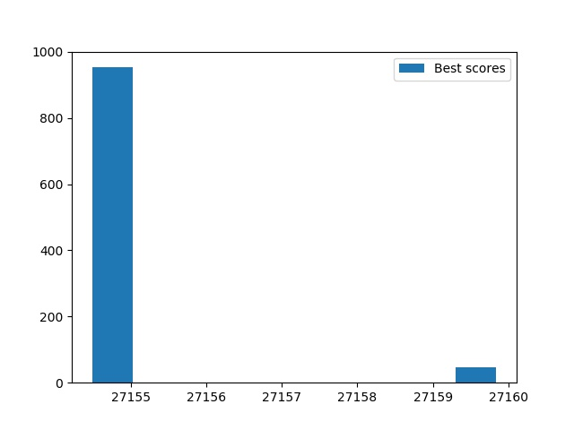
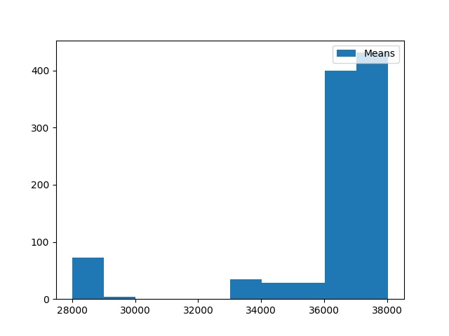

# General info
The aim of this project was to design efficient and achiving good results genetic algorithm for non-symmetric traveling salesman problem.  
I experimented with different selection, mutation, recombination etc. strategies to obtain the shortest possible paths connecting all nodes.

# Content 
The repository consist of GA.py file with all components of genetic algorithm. The main loop uses multiprocessing to enable maintaining two generations at the same time and dealing with problems of different sizes. 
Three .csv files consist of the tables representing distaces between nodes.

# Technologies
Project was created with Python 3.8.

# Figures
As it is an probabilistic algorithm, we can expect little bit different results every time we run the algorithm.  
This are the outcomes for the smallest problem. 
Best scores in 1000 runs: 
 
Mean scores for the whole population in 1000 runs: 

